# **Sistema IoT para Detección de Incendios en los Cerros Orientales de Bogotá**

## **Estructura de la documentación**

- [Resumen General](#resumen-general)
    - [Motivación](#motivación)
    - [Justificación](#justificación)
- [Solución propuesta](#solución-propuesta)
  - [Restricciones de diseño](#restricciones-de-diseño)
  - [Arquitectura](#arquitectura)
  - [Desarrollo Teórico Modular](#desarrollo-teórico-modular)
  - [Estándares de diseño de ingeniería aplicadas](#estándares-de-diseño-de-ingeniería-aplicadas)
  - [Esquemático de hardware](#esquemático-de-hardware)
- [Configuración experimental](#configuración-experimental)
    - [Resultados y análisis](#resultados-y-análisis)
- [Autoevaluación del protocolo de pruebas](#autoevaluación-del-protocolo-de-pruebas)
    - [Retos presentados](#retos-presentados)
- [Conclusiones](#conclusiones)
    - [Trabajo Futuro](#trabajo-futuro)
- [ACTAS DE TRABAJO](#actas-de-trabajo)
- [Anexos](#anexos)
  - [Anexo A. Requerimientos funcionales del sistema](#anexo-a-requerimientos-funcionales-del-sistema)
  - [Anexo B. Requerimientos no funcionales del sistema](#anexo-b-requerimientos-no-funcionales-del-sistema)
  - [Anexo C. Esquemático del hardware](#anexo-c-esquemático-del-hardware)
  - [Anexo D. Sitio web simulado](#anexo-d-sitio-web-simulado)
  - [Anexo E. Arquitectura Reto-2-IOT](#anexo-e-arquitectura-reto-2-iot)
  - [Anexo F. Código fuente del prototipo](#anexo-f-código-fuente-del-prototipo)
  - [Anexo G. Código fuente del prototipo](#anexo-g-código-fuente-usado-en-la-raspberry-pi)
- [REFERENCIAS](#referencias)

## **Resumen General**

Este informe presenta la tercera fase de desarrollo de un prototipo funcional basado en un sistema IoT para monitorizar en tiempo real las condiciones ambientales en los cerros orientales de Bogotá, Colombia, con el objetivo de detectar incendios de forma temprana. La solución utiliza un microcontrolador ESP32, sensores de temperatura, humo/gases y llama, y una Raspberry Pi como Gateway IoT, integrados con una plataforma en la nube (Ubidots) para almacenamiento y visualización de datos.

En esta etapa, el sistema incorpora un tablero de control accesible desde cualquier navegador web, tanto localmente a través de la WLAN de la alcaldía como globalmente vía internet. Este tablero permite a las autoridades visualizar valores actuales e históricos de las variables ambientales, recibir notificaciones automáticas ante eventualidades, y desactivar alarmas físicas in situ. Los datos son transmitidos mediante el protocolo MQTT desde el ESP32 a la Raspberry Pi, donde se almacenan en una base de datos SQLite antes de ser enviados a Ubidots. El ESP32 aloja un servidor web embebido para el tablero local, mientras que Ubidots proporciona el tablero global.

### **Motivación**

Los cerros orientales de Bogotá son un ecosistema de alto valor ecológico, pero su vulnerabilidad a incendios forestales, agravada por sequías y actividades humanas, requiere soluciones de monitoreo avanzadas [1]. La capacidad de monitorizar en tiempo real, notificar incidentes tanto in situ como remotamente, y acceder a datos desde cualquier ubicación local o global mejora la respuesta de las autoridades, reduciendo daños al ecosistema y protegiendo a las comunidades cercanas.

### **Justificación**

La implementación de un sistema de detección temprana de incendios con un tablero de control en tiempo real garantiza no solo una respuesta inmediata ante condiciones de riesgo, sino también una gestión eficiente de los recursos disponibles para combatir emergencias. El servidor web embebido en el ESP32 proporciona acceso local, mientras que la plataforma IoT en la nube ofrece acceso remoto, creando así un sistema con mayor disponibilidad.

La incorporación de la Raspberry Pi permite procesar los datos antes de enviarlos a la nube, reduciendo el tráfico de red y posibilitando la implementación de algoritmos de análisis más complejos.

La utilización del protocolo MQTT asegura una comunicación eficiente y confiable entre los dispositivos IoT, el Gateway y la plataforma en la nube, incluso en condiciones de conectividad limitada o intermitente, característico de zonas montañosas como los cerros orientales de Bogotá, contribuyendo así a la prevención efectiva de incendios en esta zona ecológicamente sensible.

## **Solución propuesta**

### **Restricciones de diseño**

En esta etapa del reto, fue importante establecer las nuevas restricciones de diseño. Estas se dividieron en dos categorías principales: por un lado, los requerimientos que especifican las funciones concretas que el sistema debe cumplir para alcanzar los objetivos establecidos [2]; y por otro, aquellos que determinan estándares de eficiencia, usabilidad y fiabilidad que el sistema debe satisfacer [2]. Esta organización facilita una estructuración clara y sistemática de las demandas que orientarán el desarrollo del reto. Los detalles completos de los requerimientos funcionales se encuentran en el Anexo A, mientras que los no funcionales están detallados en el Anexo B.

### **Arquitectura**

La arquitectura planteada se basó a partir del Reto realizado anteriormente, ver Anexo E. A este se le agrego el nuevo requerimiento de la comunicación bidireccional hasta una nube en la cual se iba a dar un procesamiento de los datos. Las nuevas implementaciones son:

- **IoT Gateway:** Raspberry Pi 5, usada como intermediario para la comunicación bidireccional entre ESP32 y nube, enviando y almacenando los datos dados por lo sensores, y enviando la señal de encendido a apagado de la alarma.

- **Nube:** Se uso Ubidots como dashboard global, mostrando los datos recibidos por MQTT, y enviando la señal de estado de la alarma.

El siguiente diagrama muestra el ecosistema IOT planteado, en donde se observa el hardware, software, además de los diferentes elementos y formas de comunicación del ecosistema.

<p align="center">
  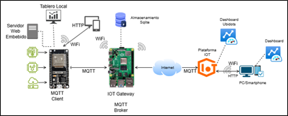
</p>

### **Desarrollo Teórico Modular**

El sistema sigue una arquitectura modular dividida en el ESP32, la Raspberry Pi y la Plataforma IOT. Este diseño permite la recolección de datos ambientales, su análisis en tiempo real, la generación de alertas cuando hay condiciones de riesgo y el acceso remoto a la información a través de dos tableros de control. Lo anterior representado mediante un diagrama de flujo UML de actividades que se presenta a continuación.

<p align="center">
  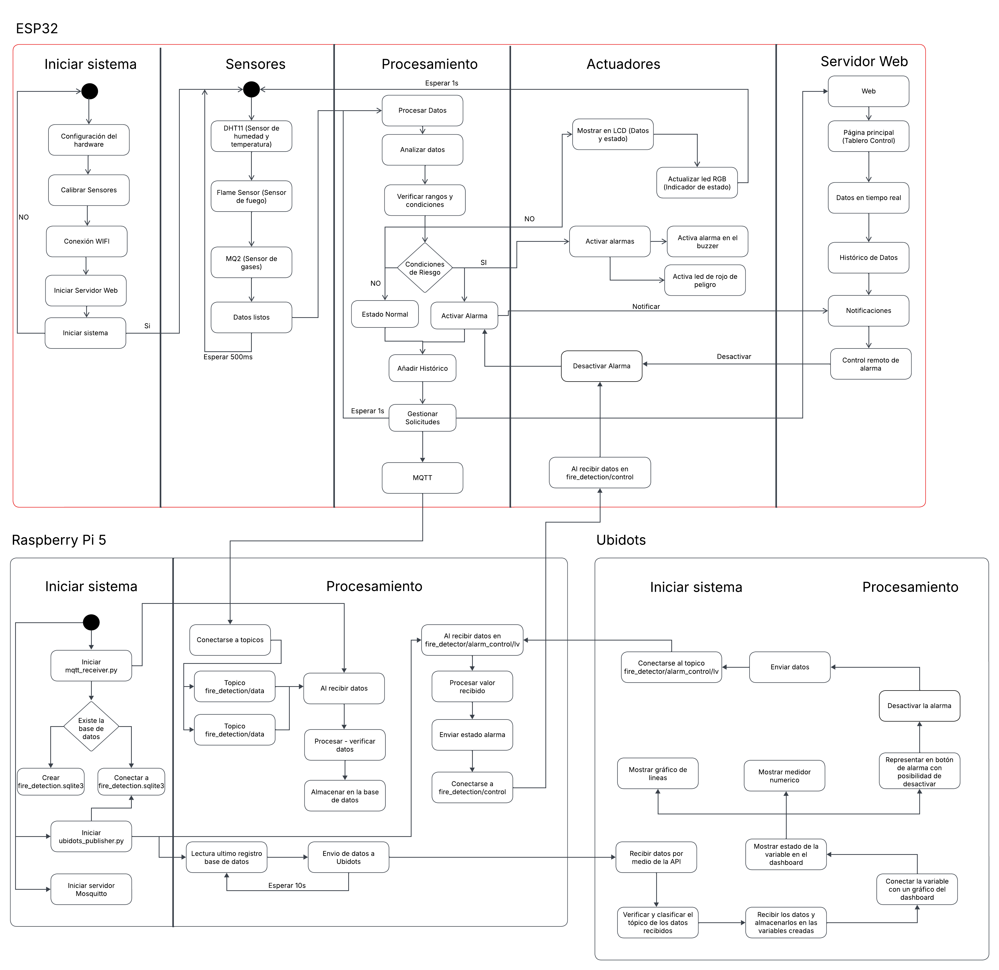
</p>

### **Estándares de diseño de ingeniería aplicadas**

Seguimos los lineamientos de los siguientes estándares para la realización del reto:

- **ISO 7240-1:2014. Fire detection and alarm systems --- Part 1: General and definitions** Este estándar hace referencia a sistemas de detección y alarmas de incendios, requerimientos para su interconexión, instalación y pruebas. Además, menciona el funcionamiento esperado por este tipo de sistemas [3].

- **ISO 25010. Calidad del producto software**. Hace referencia al grado de satisfacción que alcanza el producto de software al ser utilizado por el usuario aportando valor [4].

<p align="center">
  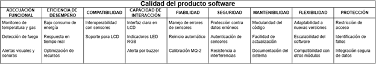
</p>

- **ISO 22320:2018. Security and resilience --- Emergency management --- Guidelines for incident management.** Este estándar marca las pautas para el manejo de incidentes, así como la importancia de comunicar en caso de un incidente [5].

- **ISO/IEC 20922:2016.** Implementación del protocolo MQTT en la comunicación bidireccional desde el ESP32 hasta la nube usada para el dashboard global.

### **Esquemático de hardware**

El esquemático de hardware se realizó en la plataforma de Wokwi, en el anexo C se encuentra una imagen del esquemático realizado, igualmente se encuentra la URL del esquemático en sí.

<p align="center">
  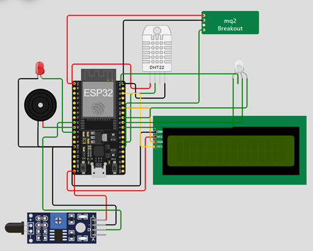
</p>

https://wokwi.com/projects/422470901977570305

### **Configuración experimental**

Tras la realización del esquemático de hardware en la plataforma de Wokwi, donde nos aseguramos de un correcto funcionamiento nos dispusimos a la elaboración del prototipo experimental de la solución, dicho prototipo no varía en forma en cuanto al prototipo del Challenge #1 y del Challenge #2. Las siguientes imágenes ilustran el prototipo construido, la primera muestra las conexiones de los cables, y la segunda ya dentro de la maqueta:

<p align="center">
  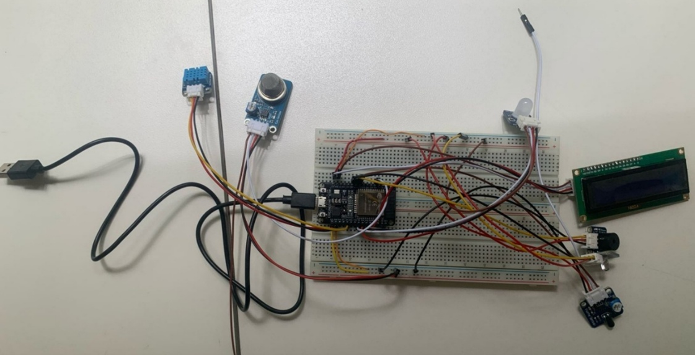
</p>

<p align="center">
  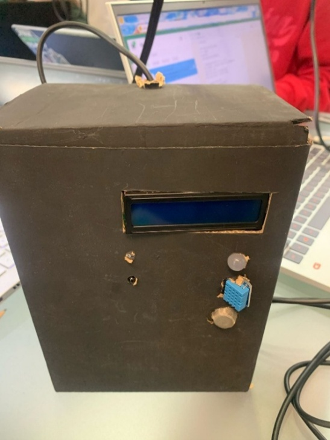
</p>

Además, para el prototipado se utilizó una raspberry pi 5, con conexión por medio de ssh, como la que se muestra a continuación:

<p align="center">
  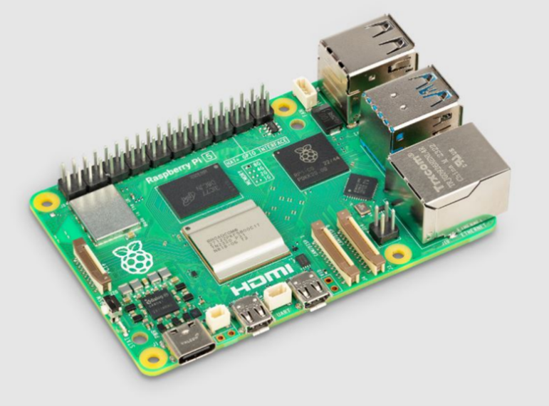
</p>

Se procedió a implementar el servidor web embebido directamente en el ESP32, alojando el tablero de control dentro del microcontrolador. Esto posibilitó que se pudiera acceder desde cualquier navegador web conectado a la misma red, sin necesidad de una infraestructura adicional. Como se muestra en la siguiente imagen.

<p align="center">
  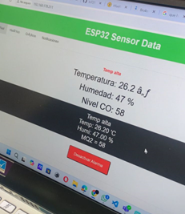
</p>

Para la configuración de la Raspberry Pi se instaló y configuró el bróker MQTT Mosquitto para gestionar la comunicación entre los dispositivos, y para que actuara como intermediario confiable. Se desarrolló un código en Python que permite suscribirse a los tópicos MQTT, procesar los datos recibidos y almacenarlos en una base de datos SQLite.

Así mismo, se estableció un puente MQTT para reenviar los datos seleccionados a la plataforma IOT, asegurando una buena integración con el sistema en la nube.

Se gestionó la plataforma IOT en este caso se usó ubidots en donde se definieron variables específicas que corresponden a la lectura de los sensores, se diseñó un dashboard que permitió visualizar en tiempo real los valores actuales y el histórico de datos, el tablero mostro la siguiente información:

- Temperatura (C°)
- Humedad (Porcentaje en el aire)
- CO (ppm)
- Presencia de una alerta por posible incendio
<div align="center">
  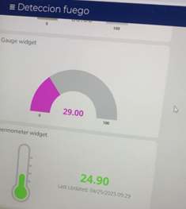
  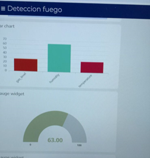
  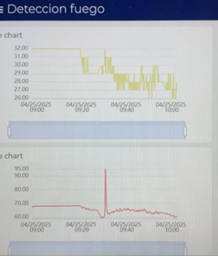
  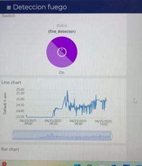
</div>

Por último, se realizó la comunicación bidireccional para lograr apagar la alarma desde el Ubidots. Durante las pruebas experimentales se simularon diferentes condiciones ambientales para verificar el correcto funcionamiento de todo el sistema integrado.

### **Resultados y análisis**

Tras elaborar el prototipo anteriormente mencionado pasamos a la fase de pruebas, durante esta fase primero nos encargamos de corroborar que las funcionalidades creadas durante el Challenge #2 se mantuvieran funcionando en su totalidad después de aplicar correctamente el sistema de hilos separados para las distintas tareas que realiza el ESP32 con FreeRTOS, cosa que ocurrió, después de esto corroboramos que se pudiera subir y ejecutar el software necesario para utilizar la raspberry pi como gateway y broker de MQTT del sistema IOT.

Posterior a ello comprobamos que la información recopilada del entorno por los sensores conectados a la ESP32 llegara a la raspberry pi por medio de MQTT, cuando esto fue exitoso se configuro y testeo que dicha información recibida se almacenase correctamente dentro de la database de sqlite3 ubicada dentro de la raspberry pi.

Seguido de esto verificamos la totalidad de las conexiones MQTT verificando que los datos recibidos y almacenados en la base de datos de sqlite3 se reflejaran correctamente en el dashboard del Ubidots previamente configurado. Por último, comprobamos el envio bidireccional de información al detener la alarma desde la plataforma de Ubidots y desde el tablero embebido en la ESP32.

De tal manera se cumplieron con todos los requisitos solicitados para el prototipado rápido. Esto a pesar de diversos problemas que se presentaron durante la realización de las pruebas y del prototipo en su totalidad.

## **Autoevaluación del protocolo de pruebas**

Para este reto, se llevó a cabo una evaluación importante del prototipo desarrollado, garantizando que se cumplieran tanto los requerimientos establecidos como las restricciones definidas. En primer lugar, se comprobó el funcionamiento correcto del ensamblaje construido en el segundo reto, que sirvió como fundamento para esta nueva fase. Se analizaron y corrigieron los fallos identificados en la retroalimentación hecha por el docente, optimizando el desempeño del sistema y asegurando el cumplimiento de todos los requerimientos.

Posteriormente, se complementó el montaje físico del prototipo, incorporando la Raspberry Pi como Gateway IOT, y se realizaron pruebas para validar su correcto funcionamiento. Esto permitió avanzar en la integración completa del sistema que incluyó:

- La transmisión de datos entre el ESP32 y la Raspberry Pi Mediante el protocolo MQTT.
- El almacenamiento de información en una base de datos Sqlite.
- La conexión con la plataforma Ubidots para la visualización remota.
- El tablero de control local alojado en el servidor web del ESP32.

Una vez teniendo el montaje físico finalizado y el código estructurado y funcional, se ejecutaron diferentes pruebas para lograr el correcto desarrollo del reto. Estas pruebas se centraron en verificar la precisión en la lectura de los sensores y su transmisión mediante MQTT, confirmar la correcta recepción y almacenamiento de datos en la Raspberry Pi, asegurar una sincronización efectiva con la plataforma Ubidots, comprobar el funcionamiento del tablero local además del tablero remoto, y evaluar la correcta ejecución de la desactivación de las alarmas desde los tableros.

Al finalizar las respectivas pruebas y realizar los ajustes necesarios cuando se requirió, se pudo evidenciar que el sistema cumplía satisfactoriamente con los requisitos establecidos.

### **Retos presentados**

Durante el desarrollo de este reto, surgieron diversos inconvenientes y retos que influyeron y afectaron el correcto progreso. Estas dificultades representaron un obstáculo que se tradujo en un esfuerzo extra para el equipo, que se dedicó a identificar y aplicar soluciones prácticas, garantizando que el proyecto se complementara exitosamente sin falta.

El primer reto que se nos presentó fue la implementación de la bidireccionalidad entre el ubidots, la raspberry pi y el ESP32. La solución de este problema en parte se convirtió en nuestro martirio. Buscando solucionar esta situación cambiamos el código encargado de publicar la información al ubidots para realizar y mejorar el entorno de pruebas para visualizar todo cambio realizado directamente en la consola de comandos de la raspberry (accedida por medio de SSH). El cambio de este código daño la conexión con Ubidots parcialmente al evitar que las variables se conectarán del ESP32 al Ubidots. Durante este proceso también se modificó el código de la ESP32 perjudicialmente.

Al día siguiente de pruebas por cuestiones de salud, no todos los miembros del equipo pudieron estar para continuar con las pruebas, esto repercutió en que cambiaron las credenciales de conexión al raspberry, al cambiar de dispositivo que cumplió el rol de router. Durante este día nos dedicamos a restaurar las conexiones entre los dispositivos, así como identificar todos los errores de los códigos y corregirlos.

Otro reto presentado fue que los datos de los sensores no se visualizaban correctamente en la plataforma IOT Ubidots, a pesar de haber establecido la conexión MQTT desde la Raspberry Pi. Para solucionar este inconveniente, se realizó una revisión entre los tópicos MQTT configurados y la estructura especifica requerida en Ubidots las cuales no estaban correctamente configuradas. Adicionalmente se descubrieron inconsistencias en los nombres de las variables enviadas, junto con problemas en el formato de los datos transmitidos. La solución implementada consistió en reestructurar los tópicos MQTT, estandarizar los nombres de las variables en todos los componentes del sistema y normalizar el formato de los datos enviados a valores numéricos compatibles con la plataforma.

Finalmente, cuando funcionó la conexión bidireccional se la realizaron unos pequeños cambios para que la implementación sea más útil y menos escandalosa.

## **Conclusiones**

El sistema realizado para el Challenge #3 nos da una introducción a las utilidades y plataformas IoT que se utilizan en el mercado, además de ejemplificarnos el cómo se construye un sistema de estas características, los retos que se presentan, así como nos da la idea de las capacidades que tiene la implementación de estas tecnologías en otros casos o necesidades que se pueden presentar en el día a día de organizaciones o personas.

De igual manera, nos adentra al mundo del raspberry pi, con una de sus tantas utilidades y el aprendizaje relacionado con su funcionamiento nos incita a pensar sobre las posibilidades y casos de uso que puede tener para el proyecto del semestre y para la vida laboral.

En caso de que un sistema con las mismas características que el prototipo solicitado se implemente correctamente ayudaría inmensamente al mantenimiento y cuidado de los cerros orientales de Bogotá al poder monitorear y notificar sobre alguna situación desde donde sea que este la persona indicada, mejorando la comunicación y los

### **Trabajo Futuro**

Como trabajo futuro, se plantea el desarrollo de un modelo predictivo avanzado que aproveche los datos históricos recopilados por el sistema para anticipar posibles incendios, identificando patrones y tendencias que permitan una intervención preventiva. Además, se busca optimizar el consumo energético del ESP32 mediante la implementación de modos de bajo consumo para extender la vida útil de los dispositivos en entornos remotos. Se propone también crear una aplicación móvil que facilite la recepción de alertas offline y notificaciones directas a las autoridades, garantizando una respuesta inmediata incluso en áreas con conectividad limitada. Para ampliar la cobertura, se planea escalar el sistema mediante la integración de múltiples nodos ESP32, permitiendo monitorear áreas más extensas de los cerros orientales y otros ecosistemas vulnerables. Finalmente, se fortalecerá la seguridad del sistema incorporando autenticación en el protocolo MQTT y habilitando HTTPS en el servidor web embebido, asegurando la protección de los datos transmitidos y la integridad de las comunicaciones en todo el sistema IoT.

## **ACTAS DE TRABAJO**

Antes de iniciar con el desarrollo del reto se llevó a cabo una planificación y asignación de tareas, las cuales se distribuyeron entre los integrantes del equipo conforme se muestra en la siguiente imagen:

<p align="center">
  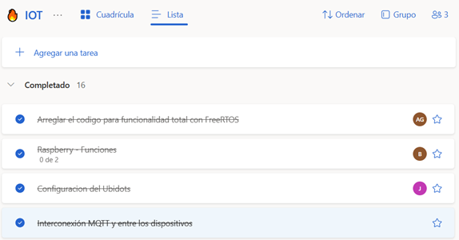
</p>

Como se puede observar en la imagen, el proceso comenzó con la corrección de los errores identificados en el Challenge #2, para luego dar paso al desarrollo del Challenge #3.

Este inició el 21 de abril, fecha en la que cada miembro del equipo trabajó en las tareas asignadas. Posteriormente, el 22 de abril, durante las horas de clase, se logró un avance significativo que permitió integrar los esfuerzos de cada uno, asegurando que el reto se completara de manera exitosa y cumpliendo con los objetivos establecidos.

Este día 22 de abril se logró realizar la conexión entre el ESP32 y la Rasperry Pi para la transmisión de datos, además se configuro la base de datos.

Posteriormente el día 23 de abril se avanzó con la integración de la Rasperry Pi a la plataforma IOT Ubidots, en la cual hubo algunos fallos porque los datos de las variables no se visualizaban correctamente en la plataforma.

El trabajo continuó entre el día 24 y 25 de abril, realizando pruebas y logrando que todo funcionara correctamente. Teniendo en cuenta que en estos días se logró implementar la comunicación bidireccional entre Ubidots y el ESP32, permitiendo la desactivación remota de las alarmas desde la plataforma IOT.

## **Anexos**

### **Anexo A. Requerimientos funcionales del sistema.**

| **ID** | **Descripción** |
|--------|----------------|
| RF-01  | El sistema debe implementar un servidor web embebido en el ESP32 para alojar el tablero de control. |
| RF-02  | El tablero de control debe ser accesible desde cualquier navegador web dentro de la WLAN local proporcionada por la alcaldía. |
| RF-03  | El sistema debe implementar un tablero de control global en una plataforma IoT basada en nube (Ubidots) accesible desde cualquier parte del mundo. |
| RF-04  | El sistema debe mostrar en ambos tableros de control (local y global) los valores actuales de las variables físicas monitorizadas (temperatura, humedad, gases, humo y llama). |
| RF-05  | El sistema debe presentar un histórico reciente de las mediciones realizadas para cada variable monitorizada. |
| RF-06  | El sistema debe emitir notificaciones en el tablero de control cuando se detecten condiciones de riesgo. |
| RF-07  | El sistema debe permitir desactivar remotamente las alarmas físicas desde cualquiera de los tableros de control. |
| RF-08  | La medición de variables en el ESP32 debe ejecutarse desde un ISR o hilo diferente al hilo principal de ejecución. |
| RF-09  | El sistema debe implementar el protocolo MQTT para la comunicación entre el dispositivo IoT (ESP32) y el Gateway IoT (Raspberry Pi). |
| RF-10  | El sistema debe implementar el protocolo MQTT para la comunicación entre la Raspberry Pi y la plataforma IoT (Ubidots). |
| RF-11  | El sistema debe almacenar los datos capturados en una base de datos SQLite en la Raspberry Pi antes de su transmisión a la plataforma IoT. |
| RF-12  | El sistema debe notificar in situ mediante alarmas físicas cuando se detecten condiciones de riesgo. |

### **Anexo B. Requerimientos no funcionales del sistema.**

| **ID** | **Descripción** |
|--------|----------------|
| RNF-01 | Ambos tableros de control (local y global) deben ser responsive, permitiendo su visualización desde PCs o teléfonos celulares. |
| RNF-02 | El sistema debe garantizar actualizaciones en tiempo real de los datos mostrados en ambos tableros, con un retraso máximo de 5 segundos. |
| RNF-03 | La interfaz de los tableros de control debe ser intuitiva y de fácil uso para las autoridades locales, con visualizaciones claras y accesibles. |
| RNF-04 | El sistema debe optimizar el uso de recursos del ESP32 para garantizar el funcionamiento simultáneo de la detección de variables, el servidor web y la comunicación MQTT. |
| RNF-05 | El sistema debe utilizar el protocolo MQTT para la comunicación entre dispositivos, garantizando eficiencia y fiabilidad en la transmisión de datos. |
| RNF-06 | El Raspberry Pi debe garantizar la integridad y disponibilidad de los datos almacenados en SQLite, incluso en casos de interrupciones temporales de conectividad. |
| RNF-07 | La plataforma IoT en la nube debe garantizar una disponibilidad del servicio de al menos 99.5% para asegurar el acceso continuo a los datos. |

### **Anexo C. Esquemático del hardware**

<p align="center">
  
</p>

https://wokwi.com/projects/422470901977570305

### **Anexo D. Sitio web simulado.**

<p align="center">
  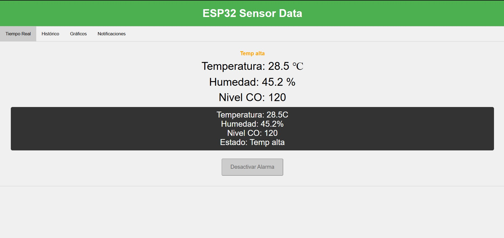
</p>

### **Anexo E. Arquitectura Reto-2-IOT**

https://github.com/BryamDigar/Reto-2-IOT?tab=readme-ov-file#arquitectura

### **Anexo F. Código fuente del prototipo**

 ```ino
 #include <DHT.h>
#include <Wire.h>
#include <LiquidCrystal_I2C.h>
#include <MQUnifiedsensor.h>
#include <WiFi.h>
#include "WebServer.h"
#include "WebPage.h"
#include <freertos/FreeRTOS.h>
#include <freertos/task.h>
#include <PubSubClient.h>
#include <ArduinoJson.h>

// Definición de pines y constantes
#define DHTPIN 4
#define DHTTYPE DHT11
#define LED_PIN 27
#define BUZZER_PIN 26
#define FLAME_PIN 25
#define Board "ESP-32"
#define Pin 34  // Usamos un pin ADC adecuado para el ESP32

#define Type "MQ-2"
#define Voltage_Resolution 3.3
#define ADC_Bit_Resolution 12 
#define RatioMQ2CleanAir 9.83

#define RED_PIN 5
#define GREEN_PIN 18
#define BLUE_PIN 19

#define TEMP_LOW 8.4
#define TEMP_HIGH 13
#define HUMI_LOW 75
#define HUMI_HIGH 80
#define FIRE_THRESHOLD LOW

#define I2C_ADDR 0x27
#define LCD_COLUMNS 16
#define LCD_LINES 2

#define HISTORY_SIZE 60 // Guardar 60 lecturas (5 minutos con lecturas cada 5 segundos)

// Inicialización del servidor web
WebServer server(HTTP_PORT);

const char* mqtt_server = "192.168.178.242"; // Dirección IP del Raspberry Pi con Mosquitto
const int mqtt_port = 1883;
const char* mqtt_client_id = "ESP32_Fire_Detector";
const char* topic_data = "fire_detection/data";
const char* topic_alert = "fire_detection/alert";
const char* topic_control = "fire_detection/control";

DHT dht(DHTPIN, DHTTYPE);
LiquidCrystal_I2C lcd(I2C_ADDR, LCD_COLUMNS, LCD_LINES);
MQUnifiedsensor MQ2(Board, Voltage_Resolution, ADC_Bit_Resolution, Pin, Type);

// Variables para almacenar lecturas de sensores
const int numReadings = 10;
float tempReadings[numReadings] = {0};
float humiReadings[numReadings] = {0};
int coReadings[numReadings] = {0};
int index_gas = 0;

QueueHandle_t sensorDataQueue;

volatile bool alarmTriggered = false;
volatile bool dataReady = false;
volatile bool environmentalAlarm = false; // Estado de la alarma por condiciones ambientales
volatile bool remoteAlarm = true;        // Estado de la alarma solicitado remotamente

// Variables para histórico de datos
float tempHistory[HISTORY_SIZE] = {0};
float humiHistory[HISTORY_SIZE] = {0};
int coHistory[HISTORY_SIZE] = {0};
String statusHistory[HISTORY_SIZE] = {""};
unsigned long timestampHistory[HISTORY_SIZE] = {0};
int historyIndex = 0;
unsigned long lastHistoryUpdate = 0;
const unsigned long historyInterval = 5000; // Actualizar cada 5 segundos

// Variables para notificaciones y alarmas
volatile bool alarmActive = false;
String notifications[5] = {"", "", "", "", ""};
int notificationCount = 0;

struct SensorData {
  float temp;
  float humi;
  int co;
};

WiFiClient espClient;
PubSubClient client(espClient);

SensorData sensorData;

byte Alert0[8] = {0b00001, 0b00010, 0b00101, 0b00101, 0b01000, 0b10001, 0b10000, 0b01111};
byte Alert1[8] = {0b00000, 0b10000, 0b01000, 0b01000, 0b00100, 0b00010, 0b00010, 0b11100};

void IRAM_ATTR triggerAlarm() {
environmentalAlarm = true;
    if (remoteAlarm) {
    alarmTriggered = true;
    publishAlert("Alerta Activada");
}
}

// Publicar datos vía MQTT
void publishData(SensorData data, String status) {
  StaticJsonDocument<200> doc;
  doc["temp"] = data.temp;
  doc["humi"] = data.humi;
  doc["co"] = data.co;
  doc["status"] = status;
  doc["timestamp"] = millis();
  
  char buffer[256];
  serializeJson(doc, buffer);
  if (client.publish(topic_data, buffer)) {
    Serial.println("Datos publicados a MQTT: " + String(buffer));
  } else {
    Serial.println("Error al publicar datos a MQTT");
  }
}

// Publicar alerta vía MQTT
void publishAlert(String message) {
  if (client.publish(topic_alert, message.c_str())) {
    Serial.println("Alerta publicada a MQTT: " + message);
  } else {
    Serial.println("Error al publicar alerta a MQTT");
  }
}

// Callback de MQTT
void callback(char* topic, byte* payload, unsigned int length) {
  String message;
  for (int i = 0; i < length; i++) {
    message += (char)payload[i];
  }
  Serial.println("Mensaje recibido en topic " + String(topic) + ": " + message);

  if (String(topic) == topic_control) {
    int controlValue = message.toInt();
    if (controlValue == 0) {
remoteAlarm = false;
      alarmTriggered = false;
      alarmActive = false;
      digitalWrite(LED_PIN, LOW);
      noTone(BUZZER_PIN);
      addNotification("Alarma desactivada remotamente");
      Serial.println("Alarma desactivada remotamente");
    } else if (controlValue == 1) {
remoteAlarm = true;
      if (environmentalAlarm) {
      alarmTriggered = true;
      alarmActive = true;
      tone(BUZZER_PIN, 1000);
      digitalWrite(LED_PIN, HIGH);
      addNotification("Alarma activada remotamente");
      Serial.println("Alarma activada remotamente");
    }
  }
}
}

// Reconectar al broker MQTT
void reconnect() {
  while (!client.connected()) {
    Serial.print("Conectando al broker MQTT...");
    if (client.connect(mqtt_client_id)) {
      Serial.println("Conectado al broker Mosquitto");
      client.subscribe(topic_control); // Suscribirse al topic de control
      Serial.println("Suscrito al topic: " + String(topic_control));
    } else {
      Serial.println("Fallo, reintentando en 5 segundos");
      vTaskDelay(5000 / portTICK_PERIOD_MS); // Esperar antes de reintentar
    }
  }
}

// Tarea para leer los sensores periódicamente
void readSensorsTask(void *pvParameters) {
  while (true) {
    sensorData.temp = dht.readTemperature();
    sensorData.humi = dht.readHumidity();
    MQ2.update();
    sensorData.co = analogRead(Pin);
    sensorData.co = map(sensorData.co, 0, 4095, 0, 100);

    xQueueSend(sensorDataQueue, &sensorData, portMAX_DELAY);
    dataReady = true;
    vTaskDelay(500 / portTICK_PERIOD_MS); // Leer sensores cada 500ms
  }
}

// Manejar la solicitud raíz del servidor web
void handleRoot() {
  server.send_P(200, "text/html", MAIN_page);
}

// Manejar las solicitudes de datos del servidor web
void handleData() {
  String status = "Monitoreo OK";
  if (sensorData.temp > TEMP_HIGH) status = "Temp alta";
  else if (sensorData.temp < TEMP_LOW) status = "Temp baja";
  else if (sensorData.humi < HUMI_LOW) status = "Humedad Baja";
  else if (alarmActive) status = "ALERTA INCENDIO!";

  String json = "{";
  json += "\"temp\":" + String(sensorData.temp) + ",";
  json += "\"humi\":" + String(sensorData.humi) + ",";
  json += "\"co\":" + String(sensorData.co) + ",";
  json += "\"status\":\"" + status + "\",";
  json += "\"alarmActive\":" + String(alarmActive ? "true" : "false") + ",";
  json += "\"lcd\":\"" + status + "\\nTemp: " + String(sensorData.temp) + " 'C\\nHumi: " + String(sensorData.humi) + " %\\nMQ2 = " + String(sensorData.co) + "\"";
  json += "}";
  server.send(200, "application/json", json);
}

void handleHistory() {
  String json = "[";
  int count = 0;
  for (int i = 0; i < HISTORY_SIZE; i++) {
    int idx = (historyIndex - i - 1 + HISTORY_SIZE) % HISTORY_SIZE;
    if (timestampHistory[idx] == 0) continue;
    if (count > 0) json += ",";
    json += "{";
    json += "\"timestamp\":" + String(timestampHistory[idx]) + ",";
    json += "\"temp\":" + String(tempHistory[idx]) + ",";
    json += "\"humi\":" + String(humiHistory[idx]) + ",";
    json += "\"co\":" + String(coHistory[idx]) + ",";
    json += "\"status\":\"" + statusHistory[idx] + "\"";
    json += "}";
    count++;
  }
  json += "]";
  server.send(200, "application/json", json);
}

void handleNotifications() {
  String json = "[";
  for (int i = 0; i < notificationCount; i++) {
    if (i > 0) json += ",";
    json += "\"" + notifications[i] + "\"";
  }
  json += "]";
  server.send(200, "application/json", json);
}

// Manejar la solicitud para desactivar la alarma
void handleDisableAlarm() {
  alarmTriggered = false;
  alarmActive = false;
  digitalWrite(LED_PIN, LOW);
  noTone(BUZZER_PIN);
  addNotification("Alarma desactivada manualmente");
  publishAlert("Alarma desactivada manualmente");
  server.send(200, "text/plain", "Alarma desactivada");
}

// Agregar una notificación al historial
void addNotification(String message) {
  for (int i = 4; i > 0; i--) notifications[i] = notifications[i-1];
  unsigned long currentTime = millis();
  String timeString = String(currentTime / 60000) + "m " + String((currentTime / 1000) % 60) + "s";
  notifications[0] = "[" + timeString + "] " + message;
  if (notificationCount < 5) notificationCount++;
}

// Agregar datos al historial
void addToHistory(float temp, float humi, int co, String status) {
  tempHistory[historyIndex] = temp;
  humiHistory[historyIndex] = humi;
  coHistory[historyIndex] = co;
  statusHistory[historyIndex] = status;
  timestampHistory[historyIndex] = millis();
  historyIndex = (historyIndex + 1) % HISTORY_SIZE;
}

void setRGB(int red, int green, int blue) {
  analogWrite(RED_PIN, 255 - red);
  analogWrite(GREEN_PIN, 255 - green);
  analogWrite(BLUE_PIN, 255 - blue);
}

// Bucle principal del programa
void myLoopTask(void *pvParameters) {
  SensorData receivedData;
  while (true) {
    server.handleClient();

    if (xQueueReceive(sensorDataQueue, &receivedData, portMAX_DELAY) == pdTRUE) {
      dataReady = false;

      // Mostrar datos en el LCD
      lcd.clear();
      lcd.setCursor(0, 0);
      lcd.print("Monitoreo OK");
      lcd.setCursor(0, 1);
      lcd.print("Temp: ");
      lcd.print(sensorData.temp);
      lcd.print("'C");
      delay(1000);
      lcd.clear();
      lcd.setCursor(0, 0);
      lcd.print("Monitoreo OK");
      lcd.setCursor(0, 1);
      lcd.print("Humi: ");
      lcd.print(sensorData.humi);
      lcd.print(" %");
      delay(1000);
      lcd.clear();
      lcd.setCursor(0, 0);
      lcd.print("Monitoreo OK");
      lcd.setCursor(0, 1);
      lcd.print("MQ2 = ");
      lcd.print(sensorData.co);
      delay(1000);
      lcd.clear();
      Serial.println("Temp: " + String(sensorData.temp) + " Humi: " + String(sensorData.humi) + " CO: " + String(sensorData.co));

      // Actualizar lecturas de sensores
      tempReadings[index_gas] = sensorData.temp;
      humiReadings[index_gas] = sensorData.humi;
      coReadings[index_gas] = sensorData.co;
      index_gas = (index_gas + 1) % numReadings;

      float tempDiff = tempReadings[index_gas] - tempReadings[(index_gas + 1) % numReadings];
      float humiDiff = humiReadings[index_gas] - humiReadings[(index_gas + 1) % numReadings];
      int coDiff = coReadings[index_gas] - coReadings[(index_gas + 1) % numReadings];

      // Detectar condiciones de alarma
      bool fireDetected = digitalRead(FLAME_PIN) == FIRE_THRESHOLD;
      bool highTemp = sensorData.temp > TEMP_HIGH;
      bool lowTemp = sensorData.temp < TEMP_LOW;
      bool lowHumi = sensorData.humi < HUMI_LOW;
      bool highCO = sensorData.co > 30;
      bool rapidChange = (tempDiff > 2) || (humiDiff < -5) || (coDiff > 5);

     if (highTemp) {
        lcd.clear();
        lcd.setCursor(0, 0);
        lcd.print("Monitoreo OK");
        lcd.setCursor(0, 1);
        lcd.print("Temp alta");
        lcd.setCursor(14,1);
        lcd.write(byte(0));
        lcd.setCursor(15,1);
        lcd.write(byte(1));
        delay(1000);
        setRGB(255, 0, 0);
        lcd.clear();
      } else if (lowTemp) {
        lcd.clear();
        lcd.setCursor(0, 0);
        lcd.print("Monitoreo OK");
        lcd.setCursor(0, 1);
        lcd.print("Temp baja");
        lcd.setCursor(14,1);
        lcd.write(byte(0));
        lcd.setCursor(15,1);
        lcd.write(byte(1));
        delay(1000);
        setRGB(255, 0, 0);
        lcd.clear();  
      } else if (lowHumi) {
        digitalWrite(LED_PIN, HIGH);
        lcd.clear();
        lcd.setCursor(0, 0);
        lcd.print("Monitoreo OK");
        lcd.setCursor(0, 1);
        lcd.print("Humedad Baja");
        lcd.setCursor(14,1);
        lcd.write(byte(0));
        lcd.setCursor(15,1);
        lcd.write(byte(1));
        delay(1000);
      } else {
        setRGB(0, 255, 0);
        digitalWrite(LED_PIN, LOW);
      }  (highTemp && lowHumi) || (rapidChange && highCO);

      String status = "Monitoreo OK";
      if (environmentalAlarm && remoteAlarm && !alarmActive) {
        alarmActive = true;
        status = "ALERTA INCENDIO";
        addNotification("¡ALARMA DE INCENDIO ACTIVADA!");
        tone(BUZZER_PIN, 1000);
        digitalWrite(LED_PIN, HIGH);
        lcd.clear();
        lcd.setCursor(0, 0);
        lcd.print("Alerta incendio!!");
                delay(1000);
      }

      if (!environmentalAlarm || !remoteAlarm) {
        alarmActive = false;
        digitalWrite(LED_PIN, LOW);
        noTone(BUZZER_PIN);
      }

      // Actualizar el historial de datos
      if (millis() - lastHistoryUpdate >= historyInterval) {
        addToHistory(sensorData.temp, sensorData.humi, sensorData.co, status);
        lastHistoryUpdate = millis();
      }

      publishData(receivedData, status);
    }
    vTaskDelay(100 / portTICK_PERIOD_MS);
  }
}

// Configuración inicial del sistema
void setup() {
  Serial.begin(115200);
  
  pinMode(LED_PIN, OUTPUT);
  pinMode(BUZZER_PIN, OUTPUT);
  pinMode(FLAME_PIN, INPUT);
  pinMode(RED_PIN, OUTPUT);
  pinMode(GREEN_PIN, OUTPUT);
  pinMode(BLUE_PIN, OUTPUT);

  sensorDataQueue = xQueueCreate(5, sizeof(SensorData));
  if (sensorDataQueue == NULL) {
  Serial.println("Error al crear la cola.");
  }

  MQ2.setRegressionMethod(1);
  MQ2.setA(36974); 
  MQ2.setB(-3.109);
  MQ2.init(); 

  lcd.init();
  lcd.backlight();
  lcd.setCursor(4, 0);
  lcd.print("----*----");
  lcd.setCursor(2, 1);
  lcd.print("Alarm System");
  delay(1000);
  lcd.clear();

  Serial.print("Calibrating MQ2...");
  float calcR0 = 0;
  for(int i = 1; i <= 10; i++) {
    MQ2.update();
    calcR0 += MQ2.calibrate(RatioMQ2CleanAir);
    Serial.print(".");
  }
  MQ2.setR0(calcR0 / 10);
  Serial.println("\nCalibration complete. R0 = " + String(calcR0 / 10));

  attachInterrupt(digitalPinToInterrupt(FLAME_PIN), triggerAlarm, FALLING);
  lcd.createChar(0, Alert0);
  lcd.createChar(1, Alert1);

  // Conexión a WiFi
  Serial.println("Conectando a WiFi...");
  lcd.setCursor(0, 0);
  lcd.print("Conectando a");
  lcd.setCursor(0, 1);
  lcd.print("WiFi...");
  int attempts = 0;
  while (WiFi.status() != WL_CONNECTED && attempts < 20) {
    WiFi.begin(SSID, PASSWORD);
    delay(500);
    Serial.print(".");
    attempts++;
  }

  if (WiFi.status() == WL_CONNECTED) {
    Serial.println("\nConectado a WiFi! IP: " + WiFi.localIP().toString());
    lcd.clear();
    lcd.setCursor(0, 0);
    lcd.print("WiFi Conectado");
    lcd.setCursor(0, 1);
    lcd.print(WiFi.localIP());
    delay(2000);
  } else {
    Serial.println("\nFallo al conectar a WiFi.");
    lcd.clear();
    lcd.setCursor(0, 0);
    lcd.print("Fallo WiFi");
    while (true) delay(1000);
  }

  client.setServer(mqtt_server, mqtt_port);
  client.setCallback(callback);

  // Configuración de rutas del servidor web
  server.on("/", handleRoot);
  server.on("/data", handleData);
  server.on("/history", handleHistory);
  server.on("/notifications", handleNotifications);
  server.on("/disableAlarm", handleDisableAlarm);
  server.begin();
  Serial.println("Servidor web iniciado.");

  // Crear tarea para leer sensores
  xTaskCreate(readSensorsTask, "ReadSensorsTask", 2048, NULL, 1, NULL);
  xTaskCreate(myLoopTask, "LoopTask", 4096, NULL, 1, NULL);
}
void loop() {
  if (!client.connected()) {
    reconnect();
  }
  client.loop(); // Procesar mensajes MQTT
}
 ```

### **Anexo G. Código fuente usado en la Raspberry Pi**

Revise el código fuente usado en la Raspberry Pi en los siguientes archivos:
- [mqtt_receiver.py](/RaspBerry/mqtt_receiver.py)
- [ubidots_publisher.py](/RaspBerry/ubidots_publisher.py) 

## **REFERENCIAS**

[1] J. M. A. L. King, "Challenge#1 Statement", *Microsoft Teams*, 17 de febrero de 2025. [En línea].

[2] ISO/IEC/IEEE. (2011). "Systems and software engineering - Requirements engineering". ISO/IEC/IEEE 29148:2011.

[3] ISO 22320:2018. Security and resilience --- Emergency management --- Guidelines for incident management (2018). [En línea]. Disponible: https://www.iso.org/obp/ui/en/#iso:std:iso:22320:ed-2:v1:en [Accedido: Feb. 17, 2025].

[4] ISO 25000. "ISO/IEC 25010". [En línea]. Disponible: https://iso25000.com/index.php/normas-iso-25000/iso-25010 [Accedido: Feb. 17, 2025].

[5] ISO 7240-1:2014(en). Fire detection and alarm systems --- Part 1: General and definitions (2014). [En línea]. Disponible: https://www.iso.org/obp/ui/en/#iso:std:iso:7240:-1:ed-3:v1:en [Accedido: Feb. 17, 2025].

[6] N. Kolban, "Kolban's Book on ESP32: Programming for the ESP32," Leanpub, 2018.

[7] Espressif Systems, "ESP32 Technical Reference Manual," Ver. 5.3, 2022. [En línea]. Disponible: <https://www.espressif.com/sites/default/files/documentation/esp32_technical_reference_manual_en.pdf>

[9] RFC 7230(en), "Hypertext Transfer Protocol (HTTP/1.1): Message Syntax and Routing", 2014 [En línea]. Disponible: <https://datatracker.ietf.org/doc/html/rfc7230>